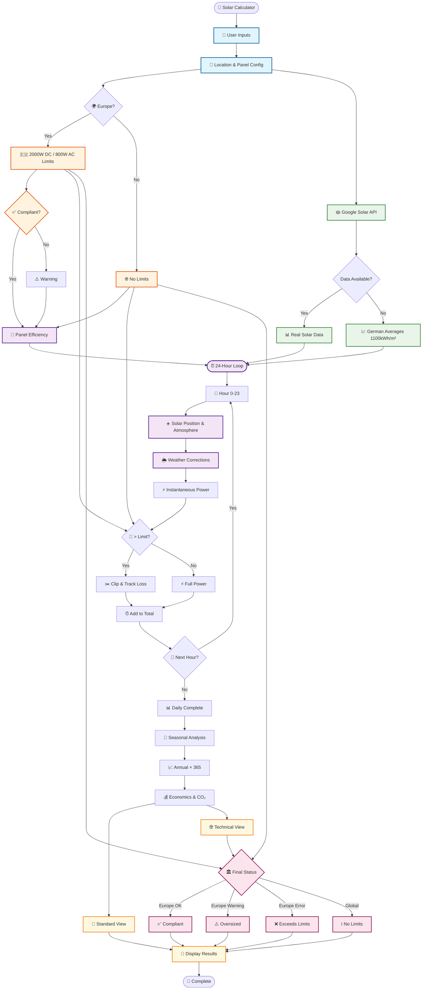

# Solar Power Calculation - Complete System Diagram

## Overview
This document provides a comprehensive visual representation of the entire solar power calculation process using one large integrated Mermaid diagram.

## Complete Solar Calculation Flow



## Key Formulas & Summary

### Core Calculations
```
Power = Panel_Watts × Efficiency × Irradiance_Factor
Clipped_Power = min(Power, Inverter_Limit)
Daily_Energy = Σ(Clipped_Power for 24 hours)
Annual_Energy = Daily_Energy × 365
```

### Regional Regulations
- **Europe**: 2000W DC / 800W AC limits with compliance checking
- **Global**: No limits, unrestricted solar sizing

### Key Features
- **🌍 Global Support**: Automatic regional detection
- **☀️ Real Solar Data**: Google Solar API integration  
- **🔧 Advanced Physics**: Solar position & atmospheric modeling
- **⚡ Realistic Clipping**: Inverter limitations with loss tracking
- **📊 Dual Views**: Standard user view + technical details
- **🏛️ Smart Compliance**: Location-aware regulatory checking
