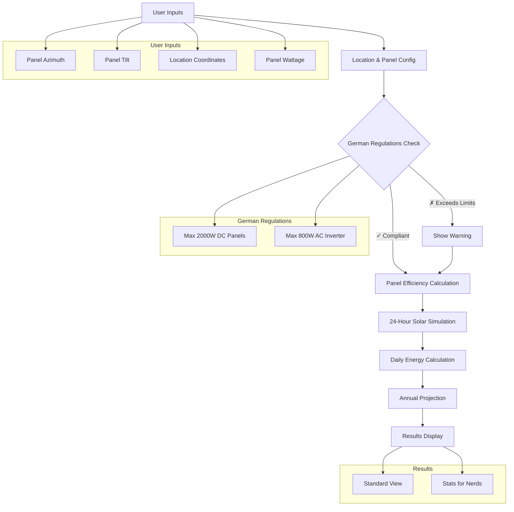
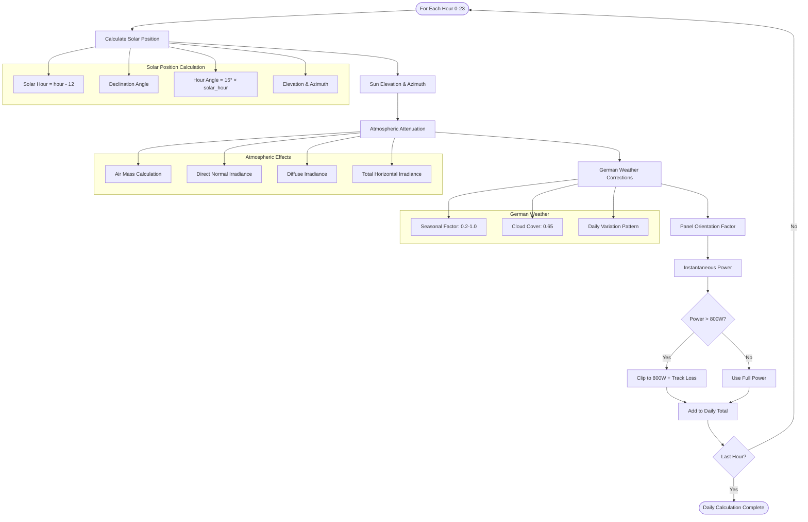
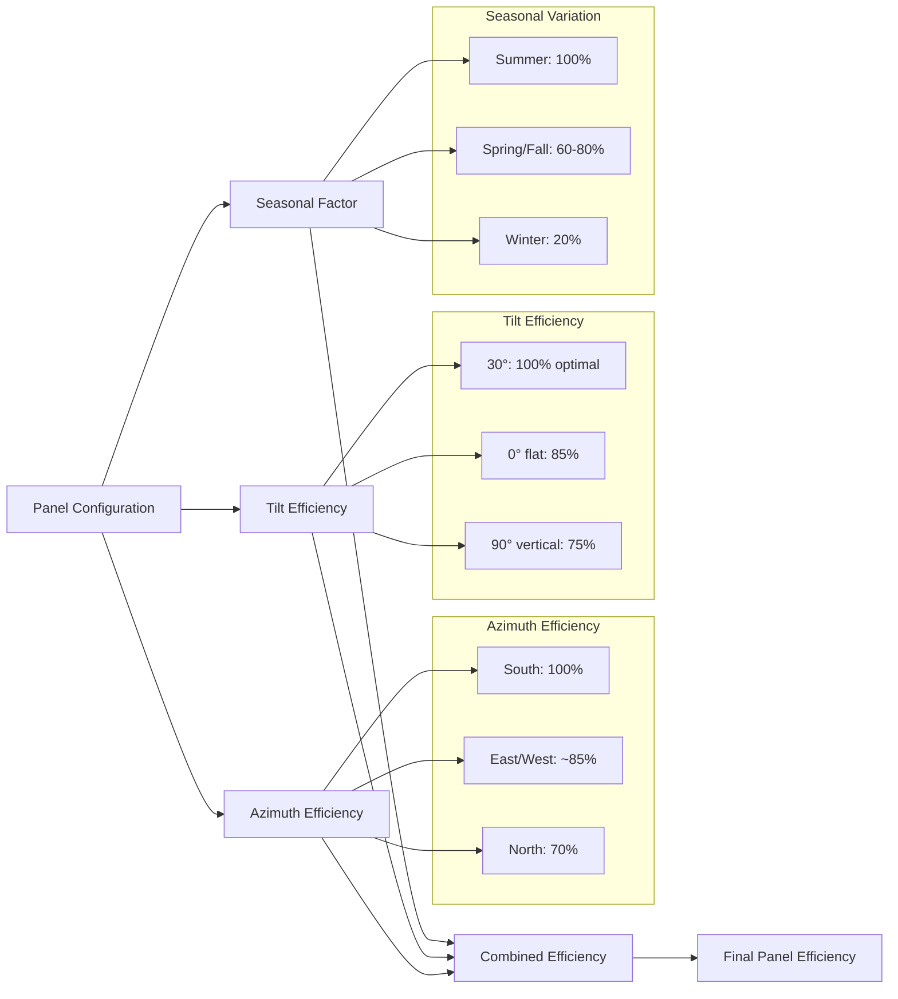
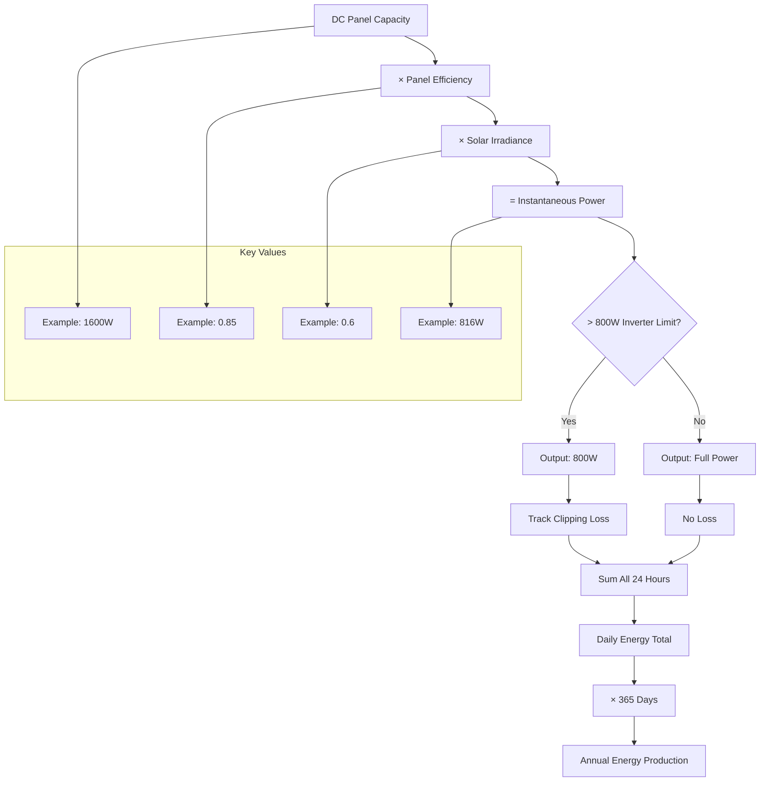
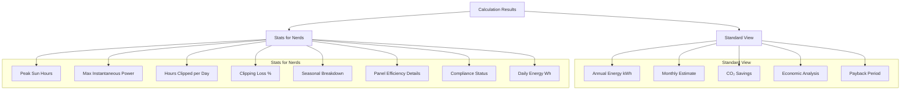
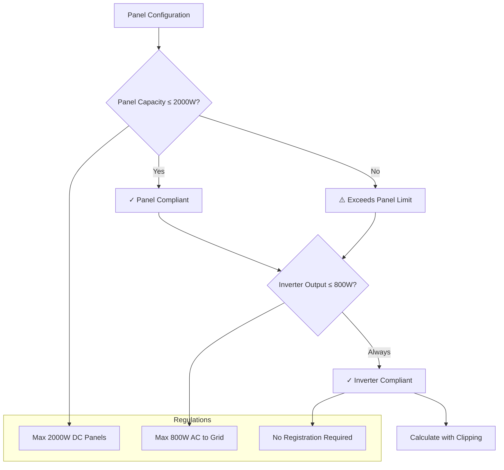

# Solar Power Calculation - Simplified Mermaid Diagram

## Overview
This document provides a simplified visual representation of the solar power calculation process using Mermaid diagrams.

## Main Calculation Flow



## Detailed Hourly Calculation Process



## Panel Efficiency Calculation



## Power Calculation Chain



## Results Structure



## German Regulations Compliance



## Key Formulas (Simplified)

### Solar Position
```
Sun Elevation = f(hour, day_of_year, latitude)
Sun Azimuth = f(hour, day_of_year, latitude)
```

### Power Calculation
```
Instantaneous Power = Panel_Watts × Efficiency × Irradiance_Factor
Clipped Power = min(Instantaneous Power, 800W)
Daily Energy = sum(Clipped_Power for 24 hours)
Annual Energy = Daily_Energy × 365
```

### Efficiency Factors
```
Panel Efficiency = Azimuth_Factor × Tilt_Factor × Seasonal_Factor
German Weather Factor = 0.65 (average cloud cover)
Seasonal Range = 0.2 (winter) to 1.0 (summer)
```

## Summary

This simplified diagram shows the core calculation flow:

1. **Input Validation** → German regulations check
2. **Efficiency Calculation** → Panel orientation and seasonal factors
3. **Hourly Simulation** → 24-hour solar position and power calculation
4. **Clipping Application** → 800W inverter limit with loss tracking
5. **Results Generation** → Standard and detailed technical views

The system ensures realistic German balcony solar predictions while maintaining regulatory compliance.
